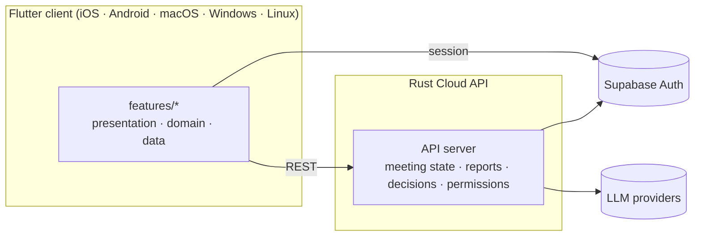

# Solomon

Solomon is an AI-native decision workspace for teams: it turns meetings, documents, and signals
into tracked decisions, follow-up tasks, and reports — with AI personas assisting review instead
of teams manually chasing every follow-up.

## How it fits together

The Rust API is the single source of truth for meeting-state transitions, report generation,
RAG selection, cost limits, and permission checks — the client only renders results, it never
re-implements those rules.

## Core loop

Connect sources → collect signals → review → decide / assign tasks → track → report → automate.

## Repositories

| Repo | What it is |
|---|---|
| [`solomon`](https://github.com/Solomon-Platform/solomon) | Monorepo: Flutter client + Rust Cloud API |
