# Solomon

Decisions made in a meeting live in someone's notes, if they're written down at all, and
follow-ups fall through because no system tracks whether they actually happened. Solomon is an
AI-native decision workspace for teams: it turns meetings, documents, and incoming signals into
tracked decisions, follow-up tasks, and reports, with AI personas assisting review instead of
people manually chasing every follow-up.

## Core loop

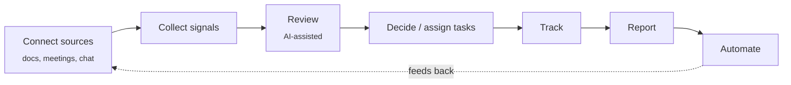

Everything under "Decide / assign" produces a **decision** or a **directive** (task) that stays
attached to the meeting/document it came from, so reports are always traceable back to source.

## Data model

A decision or directive always keeps a pointer back to the meeting or document that produced it,
and a report is assembled from that trail — not from someone's memory of what was said.

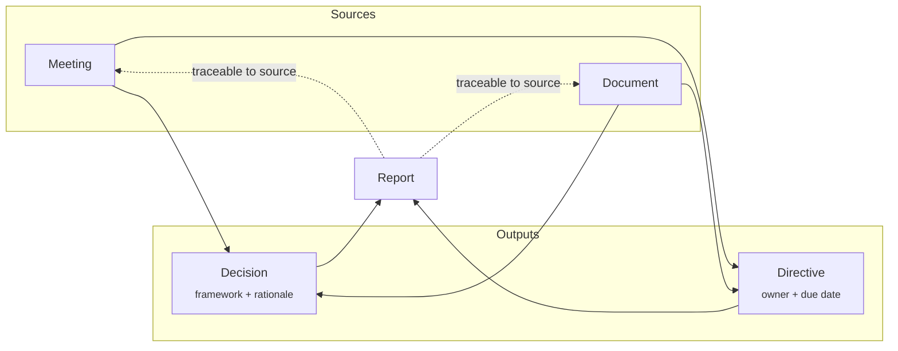

## System architecture

Client and server are both organized as layered/Clean Architecture, so the domain rules on each
side stay independent of frameworks (Flutter, Axum, Postgres).

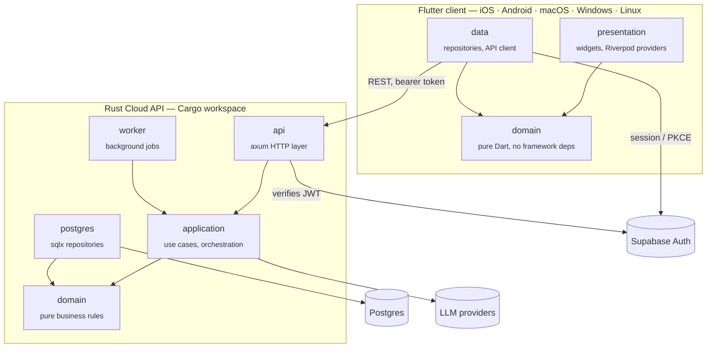

**Authority stays server-side.** Meeting-state transitions, report generation rules, RAG
selection, cost limits, and permission checks live only in the Rust `domain`/`application`
crates — the Flutter client never re-implements them, it renders whatever the API returns. A
client-supplied `workspace_id`, `user_id`, role, or cost estimate is never treated as an
authorization source by the server.

## AI review engine (conceptual)

None of this code is public — this diagrams the *shape* of the system, not the implementation.
The model never writes state directly: it proposes a transition, and a total guard function
either accepts it and persists the next state, or rejects it outright.

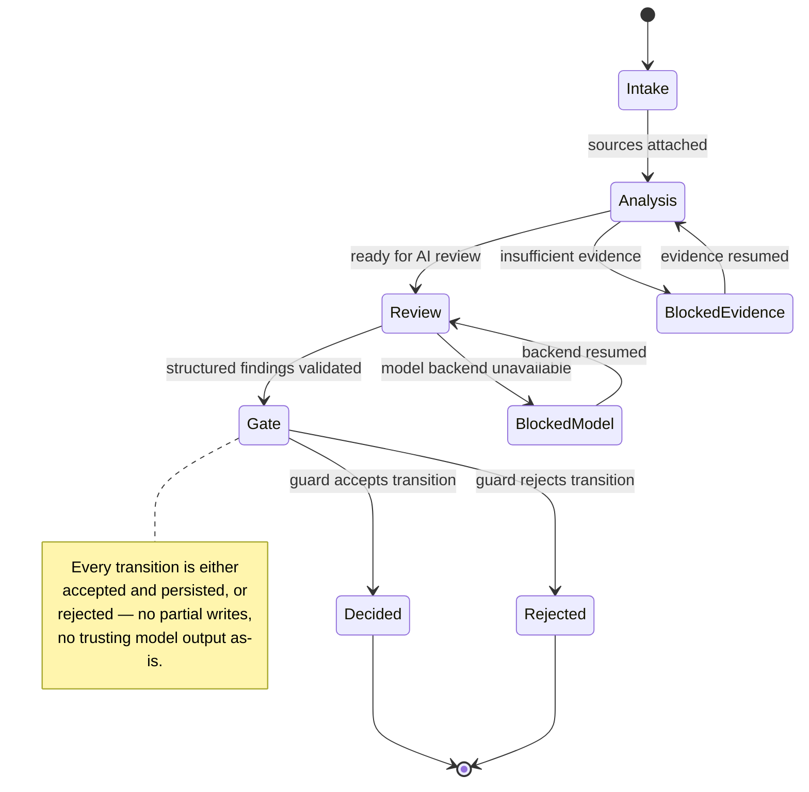

Reviews themselves are structured, multi-axis findings validated against a fixed schema before
they're allowed near the guard — malformed or out-of-range output is a hard rejection, not a
best-effort parse. Job processing is safe under concurrency, and every accepted transition is
content-addressed so what the model saw and what it decided are both reconstructable later:

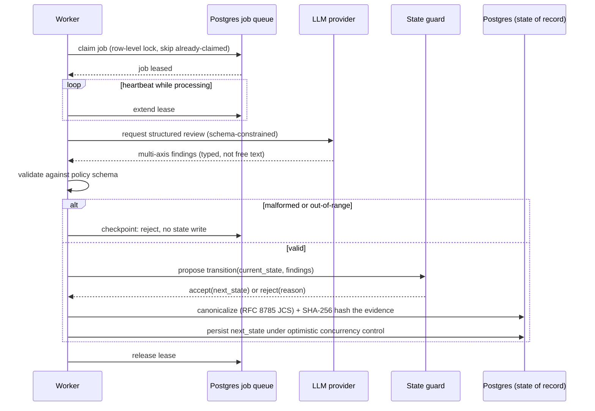

The interesting engineering problem isn't "call an LLM" — it's constraining what an LLM's output
is allowed to do to a system of record, and making every step of that auditable. The specific
review axes, approval-policy thresholds, and prompts are the actual product and stay closed.

## Security & control-plane architecture

An analysis of Palantir's publicly documented enterprise LLM architecture (Foundry / AIP /
Ontology / Apollo / Gotham), reframed as Solomon's target control plane. Every claim below is
graded by evidence level — Verified Fact (directly stated in official docs), Likely Inference
(structurally derived from combining several official docs), or Unknown (not confirmed by public
material) — and only Verified Fact is treated as a product claim.

### Bottom line

1. **An LLM is not a security boundary.** Authorization has to be enforced by the authenticated
   session, Ontology lookups, object/property policy, and function/Action submission criteria —
   not by the model.
2. **An Ontology is not a knowledge graph.** It's an operating contract that binds data meaning,
   relationships, permissions, logic, and the allowed actions together.
3. **No-retention and no-transmission are different things.** Using an external model means the
   selected prompt and context are sent to an external inference runtime, whatever the retention
   policy says afterward.
4. **Fully internal processing is a deployment choice.** Banning external egress outright
   requires a customer-hosted, on-prem, or air-gapped path.
5. **Writes must be constrained to formalized actions.** Free-text model output is never executed
   directly — it goes through typed Actions, approval, re-validation, audit, and rollback.
6. **Solomon should copy the control plane before the platform.** Gateway, Policy, Permission,
   Context, Evidence, Audit, Risk, and Human Approval come first — not a Foundry-scale data
   platform.

```mermaid
flowchart LR
    U["User"] --> APP["Application"]
    APP --> IAM["Identity / Session"]
    IAM --> ONT["Ontology"]
    ONT --> POL["Policy + Permission"]
    POL --> CTX["Authorized Context"]
    CTX --> GW["LLM Gateway"]
    GW --> MODEL["LLM"]
    MODEL --> TOOL["Tool / Function"]
    TOOL --> POL
    TOOL --> ACT["Typed Action"]
    ACT --> HITL["Human Approval"]
    HITL --> WRITE["Governed Write"]
    GW --> AUDIT["Audit + Evidence"]
    ACT --> AUDIT

    classDef trusted fill:#e8f7f5,stroke:#168b86,color:#102a2a;
    classDef model fill:#fff4df,stroke:#d88a00,color:#3b2600;
    classDef control fill:#eaf1fb,stroke:#3d70b2,color:#12233b;
    class IAM,ONT,POL,CTX,TOOL,ACT,HITL,WRITE,AUDIT trusted;
    class MODEL model;
    class APP,GW control;
```

> The point isn't "the LLM understands permissions" — it's that **only information and tools that
> already passed authorization are ever shown to the LLM.**

### Research approach and evidence levels

The guiding question isn't "which model does Palantir use" — it's: what data is the model shown,
under whose authority are lookups/search/tool calls performed, where are security decisions
enforced, what gets validated before model output becomes a real action, what crosses the trust
boundary when an external model is used, and can an execution be reproduced and audited later.

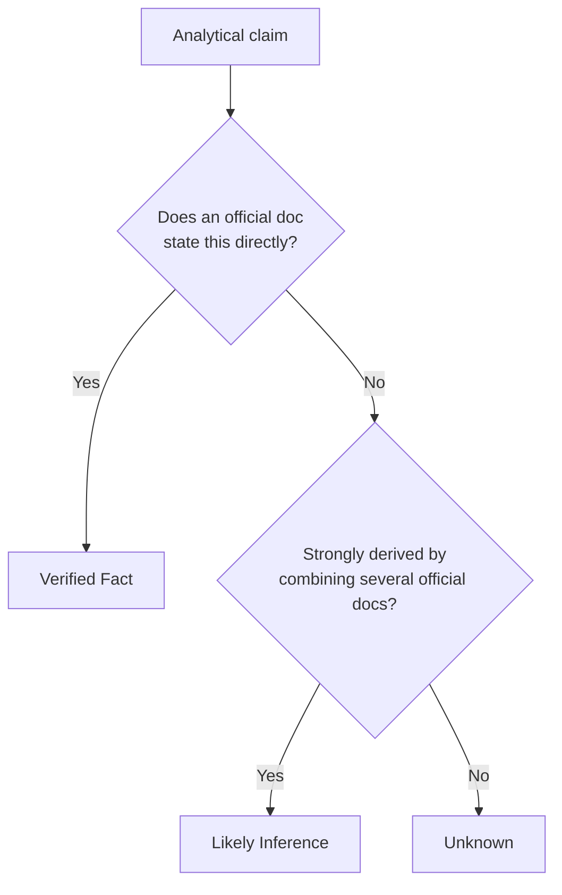

| Label | Meaning | Usage rule |
|---|---|---|
| Verified Fact | Directly confirmed in an official doc | Safe to describe as a product capability |
| Likely Inference | Structural interpretation combining multiple sources | Use as a design hypothesis, needs verification |
| Unknown | Not confirmed by public material | Never state as a product capability |

### Palantir's platform roles

| Platform | Primary role | Position in LLM integration |
|---|---|---|
| **Foundry** | Data connections, pipelines, datasets, Ontology, functions, apps, security, audit | The data/permission/business-meaning foundation |
| **AIP** | Model access, Logic, Chatbot/Agent, Evals, observability | The generative-AI application layer |
| **Apollo** | Cloud, on-prem, edge, and disconnected deployment + updates | The runtime and software-delivery layer |
| **Gotham** | Defense/intelligence/operations domain applications | A mission-app layer that composes with Foundry/Ontology |

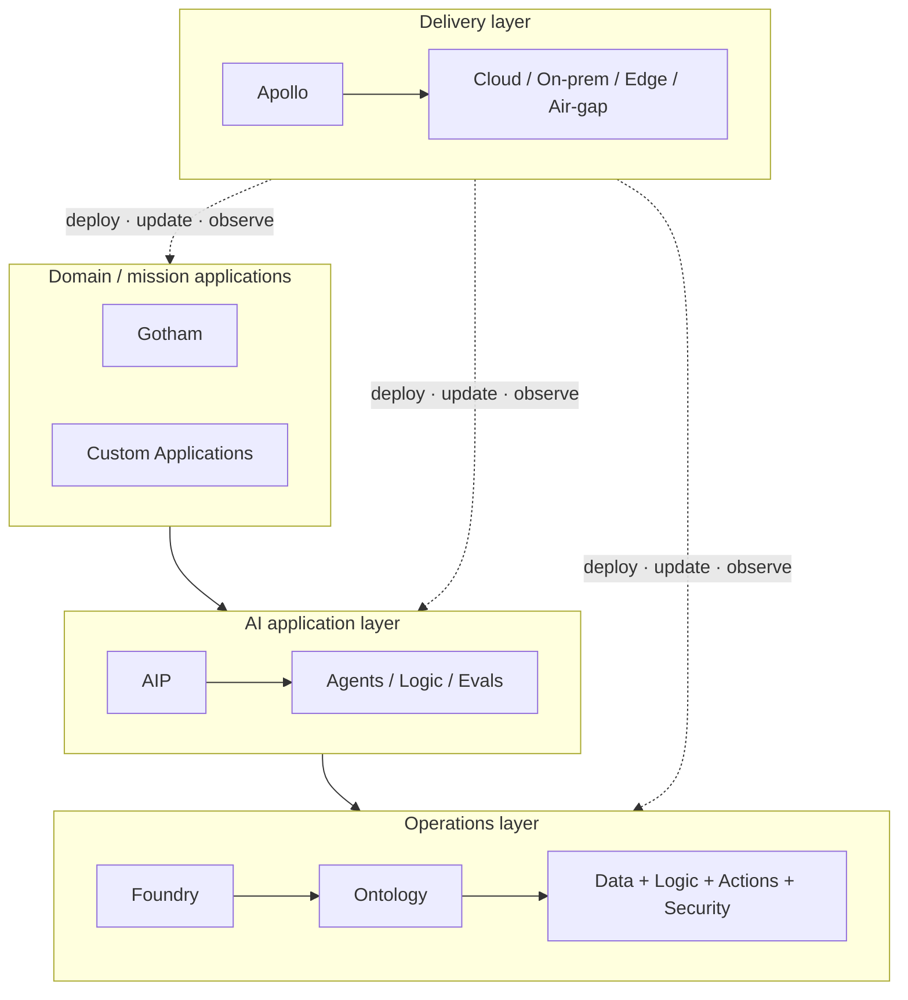

Why an Ontology isn't just a knowledge graph:

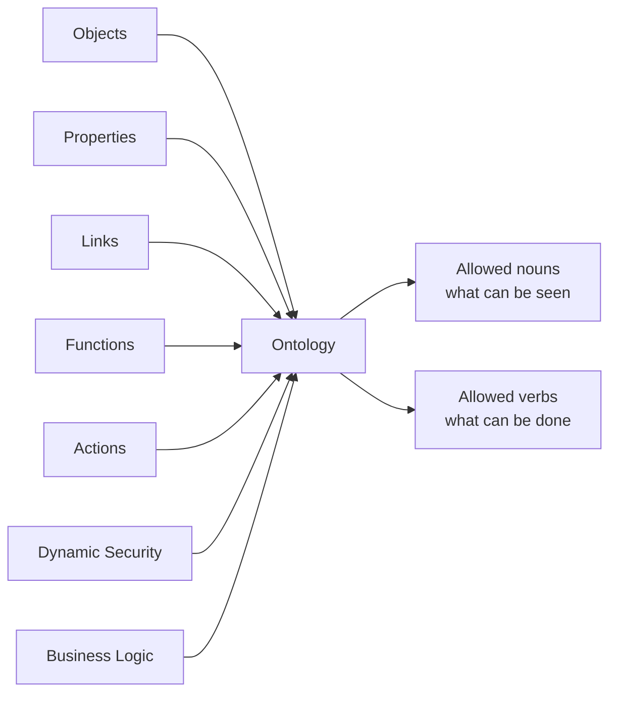

### Enterprise LLM request lifecycle

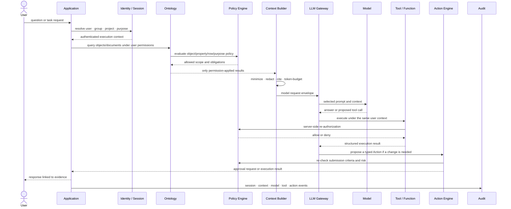

Design invariants:

- Retrieval and tool calls always pass a server-side permission check.
- Describing a user's permissions in the prompt is not enforcement.
- Tool arguments the model proposes are never trusted as-is — re-validated against schema and
  policy.
- Writes are expressed as typed Actions or constrained functions, not free text.
- Every material decision links back to user, session, policy version, model version, and
  evidence.

### Trust boundaries and enforcement points

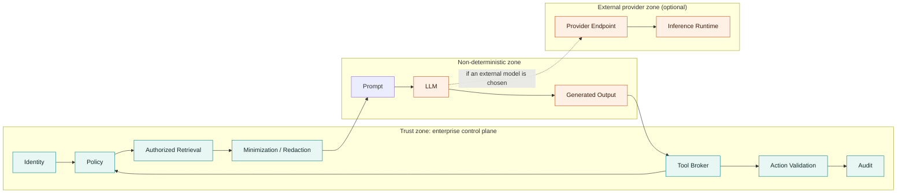

| Enforcement point | What it must decide |
|---|---|
| Identity / Session | Who, in which project, for what purpose |
| Retrieval / Ontology | Which objects, rows, properties, document chunks are visible |
| Policy Engine | Role, attribute, classification, purpose, time, region, risk conditions |
| Context Builder | Minimum necessary data, redaction, token budget, citations |
| LLM Gateway | Allowed model, region, cost, log policy, egress |
| Tool Broker | Allowed tools and arguments, re-authorization, timeout, side-effect limits |
| Action Engine | Submission criteria, approval, idempotency, rollback |
| Audit Service | Reproducible linkage from request to result |

### Permission propagation

"The LLM inherits the user's permissions" is shorthand for the outcome, not the mechanism —
every server component re-authorizes against the user or project context independently.

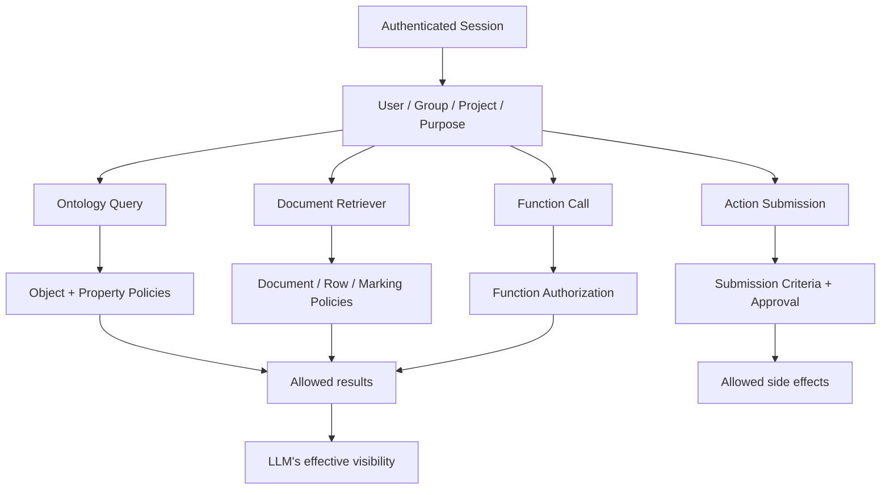

| Model | Example | Solomon application |
|---|---|---|
| RBAC | Analyst, admin, approver | Feature and default-role limits |
| ABAC | Department, project, purpose, region, data owner | Dynamic context policy |
| MAC / classification | Sensitivity, marking, compartment | Forced separation of data and model paths |

### RAG and context construction

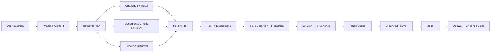

Security-critical points in RAG:

- The existence of an embedding or index must never bypass source-document permissions.
- User scope must be preserved before and after candidate generation.
- Chunks must stay linked to their source document, object, and policy version.
- Deletion and access revocation must propagate to search results and caches.
- Never assume tool and function results are auto-cited.
- The exact internal vector DB product and physical placement are not confirmed by public
  material.

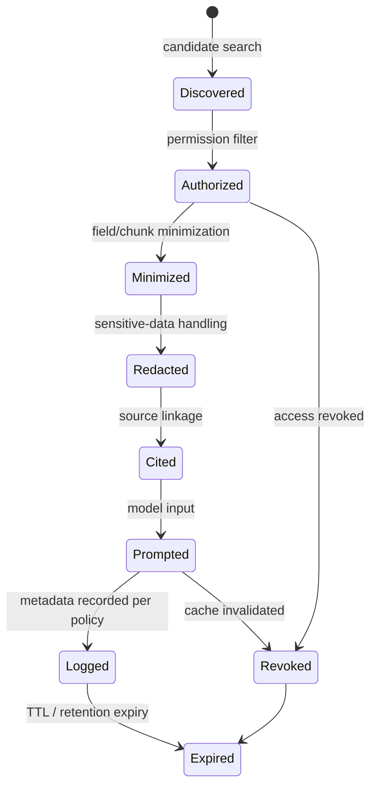

### Actions and write control

Model output is a proposed action, not an execution command. A real change has to pass schema,
permission, submission criteria, risk, approval, and idempotency.

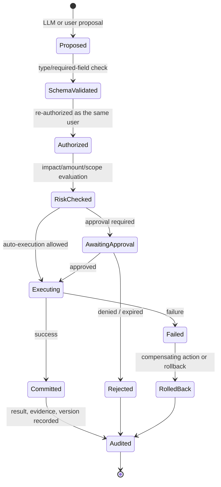

Required controls on the write path: allowed fields/value ranges per Action type; separation of
user vs. system authority; confirmation/approval/dual-approval by risk tier; request-ID-based
idempotency; before/after object state and diff logging; partial-failure compensation
transactions; replay protection on reused approvals; and linkage to policy/prompt/model version.

### Data exposure and external egress

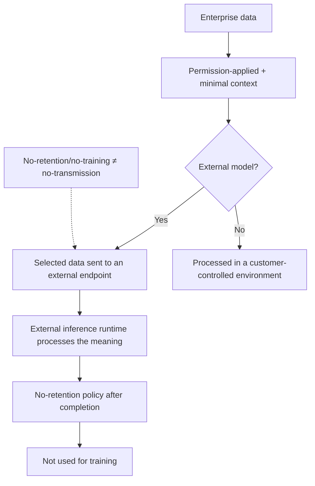

For an external model service to compute an output, the inference runtime has to process the
plaintext meaning of what was sent — transport encryption protects the network, it doesn't remove
the external processing itself.

| Stage | Control |
|---|---|
| Before retrieval | Data classification, restricted views, object/property policy, row filters |
| Context construction | Minimum fields, chunk limits, sensitive-data scanning, redaction, pseudonymization |
| Model selection | Allow-lists keyed on sensitivity, region, contract, cost |
| Network | Private link, egress allow-list, proxy, region pinning |
| Output | Schema validation, policy filter, sensitive-data check, citation check |
| Tools / actions | Server-side re-authorization, submission criteria, approval, rate/scope limits |
| Logs | Secret exclusion, separate permissions, TTL, encryption, audit |

What public material alone cannot guarantee: a general-purpose output DLP applied automatically
across every AIP path; complete prevention of prompt injection and jailbreaks; identical marking
behavior across every BYOM path; or evidence that homomorphic encryption, MPC, or differential
privacy are applied to the default LLM inference path.

### Deployment topology selection

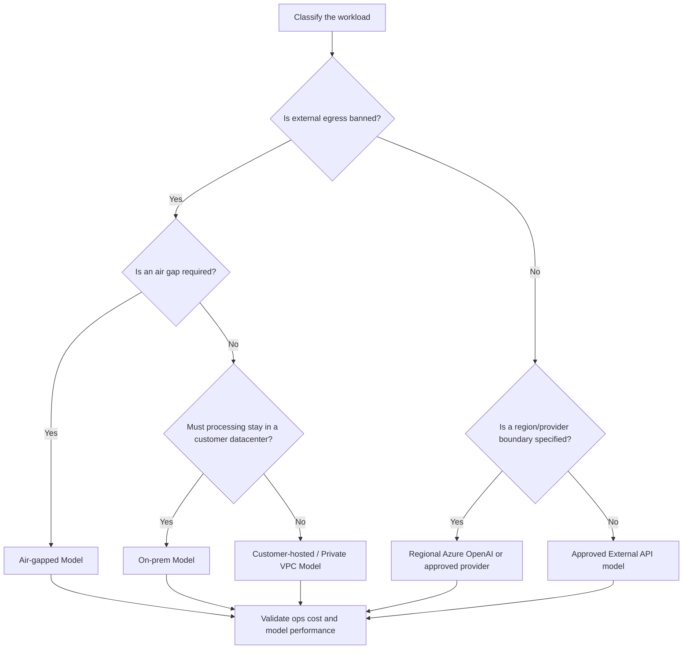

> This decision tree is a Solomon design recommendation, not a claim that Palantir ships a
> complete sensitivity-based auto-router out of the box.

| Path | External transmission | Ops control | Advantage | Main burden |
|---|---:|---:|---|---|
| External API | Yes | Low–medium | Latest models, fast adoption | Provider/region/contract dependence |
| Azure OpenAI | Yes | Medium | Region + enterprise contract integration | Azure boundary and service dependence |
| Customer-hosted | Depends on config | High | Customer network/key/log control | GPU and MLOps operations |
| On-prem | Generally none | Very high | Fully internal processing | Capacity, updates, model-choice limits |
| Air-gap | None | Highest | Disconnected, high-sensitivity | Model import, patching, eval cost |

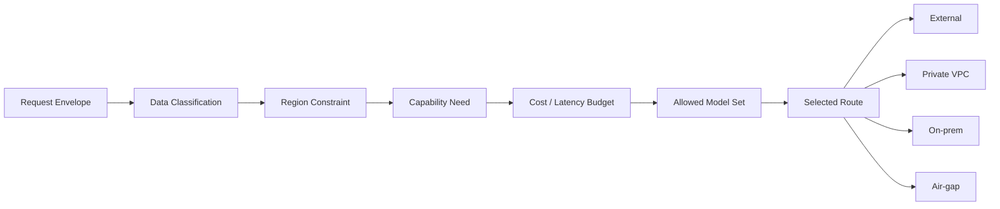

### Threat model and mitigating controls

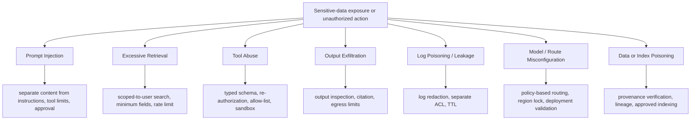

| Attack surface | Failure example | Primary defense |
|---|---|---|
| Prompt | Instructions embedded in a document override the system prompt | Separate content from instructions, hide out-of-scope tools |
| Retrieval | Broad search bulk-extracts in-scope data | Limit by purpose, scope, tokens, call volume |
| Tools | Model selects a dangerous argument or API | Typed schema, server re-authorization, approval |
| Output | Sensitive data repeatedly leaked in "answer" form | Output policy, DLP backstop, citation/evidence check |
| Logs | Secrets accumulate in prompts, responses, tool args | Minimal logging, redaction, log ACL and TTL |
| Routing | Confidential data misrouted to an external model | Classification-based deny-by-default model allow-list |
| Index | Malicious documents or stale permissions poison results | Lineage, freshness, deletion/revocation propagation |

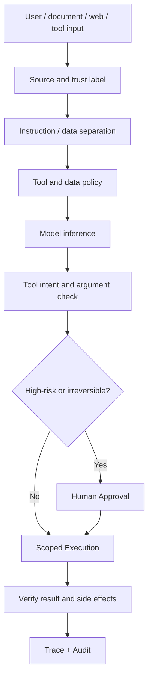

### Audit, observability, and the evidence graph

An audit event must link: request ID, session ID, parent trace ID; user/group/project/service
principal; purpose, policy version, allow/deny decision and obligations; retrieved-object and
chunk identifiers and versions; prompt template, context hash, model and model version; tool
name, argument hash, executor, result, latency; Action proposal, approver, execution result, diff
and rollback; citations, evidence-graph nodes, and the final answer; and retention period,
redaction state, access tier.

```mermaid
flowchart LR
    REQ["Request"] --> SESSION["Session"]
    SESSION --> POLICY["Policy Decision"]
    SESSION --> RETRIEVAL["Retrieved Evidence"]
    SESSION --> PROMPT["Prompt Version"]
    SESSION --> MODEL["Model Invocation"]
    MODEL --> TOOL["Tool Call"]
    TOOL --> ACTION["Action"]
    ACTION --> APPROVAL["Approval"]
    ACTION --> RESULT["Committed Result"]
    RETRIEVAL --> CITE["Citation"]
    CITE --> ANSWER["Final Answer"]
    RESULT --> ANSWER
    POLICY --> ANSWER
```

The log paradox: logging raises auditability, but a log that replicates prompts, responses,
document chunks, PII, and tool arguments becomes a new sensitive store in its own right — it
needs the same permission, encryption, redaction, and retention discipline as the source data.

### Solomon target architecture

```mermaid
flowchart TB
    subgraph UX["Experience"]
        DESKTOP["Desktop UI"]
        API["API / SDK"]
        WORKFLOW["Decision Workflow"]
    end
    subgraph EDGE["Ingress and gateway"]
        AUTH["Identity + Session"]
        LLMGW["LLM Gateway"]
        SECGW["Security Gateway"]
    end
    subgraph CONTROL["Control plane"]
        POLICY["Policy Engine"]
        PERM["Permission Engine"]
        RISK["Risk Engine"]
        ROUTER["Model Router"]
        AUDIT["Audit Service"]
    end
    subgraph KNOWLEDGE["Knowledge and context"]
        CONTEXT["Context Builder"]
        ONTOLOGY["Decision Ontology"]
        EVIDENCE["Evidence Graph"]
        MEMORY["Decision Memory"]
    end
    subgraph EXECUTION["Governed execution"]
        BROKER["Tool Broker"]
        ACTION["Action Engine"]
        APPROVAL["Human Approval"]
        ROLLBACK["Rollback / Compensation"]
    end
    subgraph MODELS["Model plane"]
        EXTERNAL["External Models"]
        PRIVATE["Private VPC Models"]
        LOCAL["On-prem / Air-gap Models"]
    end
    subgraph DATA["Enterprise data"]
        DB["Databases"]
        DOCS["Documents"]
        APIS["Enterprise APIs"]
        EVENTS["Events"]
    end
    UX --> AUTH --> SECGW --> LLMGW
    SECGW --> POLICY
    POLICY <--> PERM
    POLICY --> CONTEXT
    CONTEXT <--> ONTOLOGY
    CONTEXT <--> EVIDENCE
    CONTEXT <--> MEMORY
    ONTOLOGY --> DATA
    LLMGW --> ROUTER
    ROUTER --> EXTERNAL
    ROUTER --> PRIVATE
    ROUTER --> LOCAL
    LLMGW --> BROKER
    BROKER --> POLICY
    BROKER --> ACTION
    ACTION --> RISK
    RISK --> APPROVAL
    APPROVAL --> ACTION
    ACTION --> DATA
    ACTION --> ROLLBACK
    LLMGW --> AUDIT
    CONTEXT --> AUDIT
    ACTION --> AUDIT
```

| Component | Responsibility | Priority |
|---|---|---:|
| LLM Gateway | Model abstraction, prompt envelope, timeout, cost, fallback | P0 |
| Security Gateway | Ingress, auth, classification, egress, rate limit | P0 |
| Policy Engine | Purpose/data/tool/model/action policy | P0 |
| Permission Engine | User/group/resource permission evaluation | P0 |
| Context Builder | Permission-applied retrieval, minimization, redaction, citation | P0 |
| Audit Service | End-to-end trace and reproducibility | P0 |
| Decision Ontology | Operating model of objects, relations, decisions, actions | P1 |
| Evidence Graph | Claims and evidence, versions, lineage | P1 |
| Action Engine | Typed writes, approval, idempotency, rollback | P1 |
| Model Router | Route selection by sensitivity/region/performance/cost | P1 |
| Risk Engine | Risk scoring for actions and responses | P1 |
| Decision Memory | Long-term memory of approved decisions and outcomes | P2 |

```mermaid
flowchart LR
    R0["1. Authenticate"] --> R1["2. Classify"]
    R1 --> R2["3. Authorize Retrieval"]
    R2 --> R3["4. Build Context"]
    R3 --> R4["5. Route Model"]
    R4 --> R5["6. Generate"]
    R5 --> R6["7. Validate Output"]
    R6 --> R7["8. Authorize Tool"]
    R7 --> R8["9. Approve Action"]
    R8 --> R9["10. Execute"]
    R9 --> R10["11. Audit + Evidence"]
```

### Solomon recommended interfaces

> These JSON shapes aren't a copy of a Palantir public API — they're a recommended contract for
> applying the analysis above to Solomon.

**Request envelope**

```json
{
  "request_id": "req_01J...",
  "session_id": "ses_01J...",
  "principal": {
    "user_id": "user_123",
    "groups": ["research"],
    "project_id": "project_solomon"
  },
  "purpose": "decision_support",
  "data_labels": ["INTERNAL"],
  "region": "KR",
  "prompt": "question or task request",
  "max_risk": "medium"
}
```

**Policy decision**

```json
{
  "decision": "allow_with_obligations",
  "policy_version": "policy-2026-08-06.1",
  "allowed_object_types": ["Decision", "Evidence"],
  "allowed_properties": {
    "Decision": ["id", "title", "status"],
    "Evidence": ["id", "summary", "source_uri"]
  },
  "allowed_tools": ["search_evidence"],
  "allowed_models": ["private-general"],
  "obligations": ["redact_pii", "require_citations"],
  "max_context_tokens": 12000
}
```

**Evidence bundle**

```json
{
  "bundle_id": "evb_01J...",
  "request_id": "req_01J...",
  "items": [
    {
      "evidence_id": "ev_001",
      "source_uri": "ontology://Evidence/ev_001",
      "source_version": "42",
      "retrieved_at": "2026-08-06T03:00:00Z",
      "policy_decision_id": "pol_01J...",
      "content_hash": "sha256:..."
    }
  ]
}
```

**Action proposal**

```json
{
  "action_id": "act_01J...",
  "type": "Decision.ChangeStatus",
  "target": "decision_123",
  "arguments": {
    "status": "APPROVED"
  },
  "proposed_by": "model/private-general",
  "on_behalf_of": "user_123",
  "evidence_bundle_id": "evb_01J...",
  "risk": "high",
  "approval_required": true,
  "idempotency_key": "idem_01J..."
}
```

**Audit event**

```json
{
  "event_id": "evt_01J...",
  "trace_id": "trc_01J...",
  "event_type": "ACTION_COMMITTED",
  "principal_id": "user_123",
  "policy_version": "policy-2026-08-06.1",
  "model": "private-general",
  "prompt_template_version": "decision-agent-v7",
  "action_id": "act_01J...",
  "result_hash": "sha256:...",
  "timestamp": "2026-08-06T03:00:05Z"
}
```

### Further implementation detail

Schema and policy examples for the earliest roadmap phases.

LLM Gateway as an internal-only interface — application code never calls a model provider
directly:

```
POST /v1/decisions/chat
POST /v1/decisions/embeddings
POST /v1/decisions/rerank
POST /v1/decisions/tools/continue
```

Policy Engine, as a Cedar/OPA-style rule:

```
permit(subject, action, resource)
when {
  subject.clearance >= resource.classification
  && subject.department in resource.allowed_departments
  && context.purpose in resource.allowed_purposes
  && (
    model.zone == "LOCAL"
    || resource.external_egress == true
  )
};
```

A policy decision is never a bare boolean — it always carries obligations:

```json
{
  "decision": "ALLOW_WITH_OBLIGATIONS",
  "policy_version": "policy-42",
  "obligations": [
    "MASK:person.ssn",
    "MODEL_ZONE:LOCAL",
    "APPROVAL:TIER_2",
    "LOG_MODE:METADATA_ONLY"
  ],
  "reason_codes": [
    "PII_PRESENT",
    "EXTERNAL_EGRESS_DENIED"
  ]
}
```

Security Gateway inspection returns an obligation set, not just allow/block: `FORCE_LOCAL_MODEL`
· `MASK_PII` · `REMOVE_ATTACHMENT` · `DISABLE_TOOLS` · `REQUIRE_APPROVAL` · `NO_PERSISTENCE` ·
`REDACT_LOG` · `MAX_CONTEXT_CLASSIFICATION=INTERNAL`.

Minimum SQLite schema for an MVP permission engine:

```sql
CREATE TABLE subjects (
  subject_id TEXT PRIMARY KEY,
  attributes_json TEXT NOT NULL,
  version INTEGER NOT NULL
);
CREATE TABLE roles (role_id TEXT PRIMARY KEY);
CREATE TABLE subject_roles (
  subject_id TEXT,
  role_id TEXT,
  valid_from TEXT,
  valid_to TEXT
);
CREATE TABLE resources (
  resource_id TEXT PRIMARY KEY,
  resource_type TEXT,
  classification INTEGER,
  owner_id TEXT,
  attributes_json TEXT
);
CREATE TABLE object_policies (
  policy_id TEXT PRIMARY KEY,
  object_type TEXT,
  expression TEXT,
  version INTEGER
);
CREATE TABLE field_policies (
  policy_id TEXT PRIMARY KEY,
  object_type TEXT,
  field_name TEXT,
  expression TEXT,
  mask_strategy TEXT
);
CREATE TABLE policy_decisions (
  decision_id TEXT PRIMARY KEY,
  subject_id TEXT,
  resource_id TEXT,
  action TEXT,
  decision TEXT,
  policy_version TEXT,
  obligations_json TEXT,
  created_at TEXT
);
```

Action definition and the full Action lifecycle:

```rust
struct ActionDefinition {
    action_type: String,
    input_schema: serde_json::Value,
    required_permissions: Vec<String>,
    risk_tier: u8,
    approval_policy: String,
    idempotency_required: bool,
    dry_run_supported: bool,
    compensation_action: Option<String>,
    external_side_effect: bool,
}
```

```mermaid
stateDiagram-v2
    [*] --> Draft
    Draft --> Validated: passes schema, permission, policy
    Draft --> Failed: schema/permission/policy failure
    Validated --> ApprovalRequired: risk_tier >= threshold
    Validated --> Executable: low risk, auto-approved
    ApprovalRequired --> Executable: approved
    ApprovalRequired --> Rejected: rejected
    Executable --> Executing
    Executing --> Completed
    Executing --> Failed
    Completed --> [*]
    Failed --> Compensating: compensation requested
    Compensating --> Compensated
    Compensated --> [*]
    Rejected --> [*]
```

An LLM only ever produces an `ActionProposal` — it never holds connector credentials directly;
the Action Engine executes with a short-lived capability token instead.

Decision Ontology invariants beyond the object model above: an unapproved decision can never
create an irreversible action; every recommendation needs at least one Claim; a Verified Claim
needs versioned Evidence; Claims produced by a model default to Unverified; when Evidence is
deleted or withdrawn, its Claims become Stale; and reusing a past decision preserves the original
policy, model, and evidence version rather than silently re-evaluating against current state.

Decision Memory, split by type rather than one conversation log:

| Memory type | Content | Retention |
|---|---|---|
| Working | Current request's temporary state | Session |
| Episodic | Past decisions and situations | By policy, permission-scoped on retrieval |
| Semantic | Verified organizational knowledge | Source-linked, long-lived |
| Procedural | Approved playbooks and policy | Versioned |
| Outcome | Actual results after a decision | Long-term, for analysis |
| Personal | User preferences | Only on explicit consent |

Evidence Graph edge types: `CLAIM_SUPPORTED_BY_EVIDENCE` · `CLAIM_CONTRADICTED_BY_EVIDENCE` ·
`DECISION_DEPENDS_ON_ASSUMPTION` · `ACTION_JUSTIFIED_BY_DECISION` · `EVIDENCE_DERIVED_FROM_SOURCE`
· `SOURCE_SUPERSEDES_SOURCE` · `POLICY_ALLOWED_CONTEXT` · `MODEL_GENERATED_CLAIM` ·
`HUMAN_VERIFIED_CLAIM` — enough to answer "which document *section* backed this claim," not just
"which document was used."

Risk Engine separates deterministic checks from model-assisted ones — the model never gets final
sign-off on its own risk score:

| Risk factor | Deterministic check | Model-assisted |
|---|---|---|
| Data classification | Yes | Not needed |
| External egress | Yes | Not needed |
| User clearance | Yes | Not needed |
| Tool allow-list | Yes | Not needed |
| PII pattern | Yes | Entity extraction can supplement |
| Prompt injection | Signature/heuristic | Classifier can assist |
| Evidence fidelity | Source ID presence | NLI/LLM-judge can assist |
| Action impact | Action catalog description | Can assist |
| Unusual request rate | Rule-based | Anomaly model can assist |

Model Router priority order — security is evaluated before cost, and fallback only stays within
the same or a stricter security zone: security zone/residency → model capability → user/org
allow-list → allowed data egress → latency → quality → cost → availability.

Multi-agent: never give an agent its own long-lived API key — issue a per-request capability
token carrying allowed tools, object scope, max classification, and a token/cost/time budget.
Shared memory between agents is permission-checked artifacts, not a raw conversation dump.

### Known vulnerabilities and legal considerations

Palantir's own incident record and compliance posture, plus what a Korean deployment specifically
has to check — from a separate deep-dive on data exposure and cross-border transfer.

**Known vulnerabilities and incidents** (public record, not hypothetical):

- **CVE-2023-22833** — a Foundry Lime2 access-control bypass that let authenticated users exceed
  discretionary/mandatory access controls under certain conditions (NVD, high confidentiality
  impact).
- **PLTRSEC-2022-09** — Gotham Chat's IRC helper failed to validate TLS certificate hostnames,
  letting a privileged-network attacker read or alter traffic; patched via Apollo's automatic
  update channel.
- A 2021 media report (TechCrunch) described FBI staff retaining unauthorized access to
  investigative material through a Palantir-built system for an extended period — based on
  reporting, not an official disclosure, so the exact defect and scope aren't independently
  confirmable from public sources alone.

None of these are LLM-specific, but the pattern is worth carrying into Solomon's own threat
model: fine-grained access control can still be bypassed by implementation bugs or
misconfiguration, "the policy exists" isn't the same as "every service enforces it correctly,"
and an absence of public incident reports isn't evidence that no incidents occurred.

**Compliance posture** (Palantir Trust Portal): ISO 27001/27017/27018, SOC 1/2, FedRAMP High,
FISMA High, DoD IL5/IL6, and HIPAA BAA support are listed. None of this automatically guarantees a
given deployment is compliant — scope, region, model provider, and log handling still have to be
verified per contract; SOC 2 attests to controls over a specific period and scope, not the
absence of any possible breach.

**Cross-border transfer under Korea's PIPA** — directly relevant for a Korean-built product.
Korea's Personal Information Protection Act treats overseas *viewing or processing* of personal
data as a transfer, not just storage — so routing a prompt containing Korean users' personal data
to a US/EU model endpoint is likely subject to overseas-transfer review even when the provider
never retains it. "Deleted immediately after processing" reduces retention risk but doesn't
remove the transfer/processing event itself. PIPC's 2025 generative-AI guidance covers legal
basis and safeguards across the full pipeline for both commercial and open-source models, and
PIPC's 2025 review of DeepSeek treated user prompts as subject to overseas-transfer rules — a
concrete signal that "the prompt is just technical data" isn't a safe assumption.

Minimum review items before sending Korean personal data through any external model: purpose and
minimum-necessary collection (only pass the objects/fields actually needed); the processor and
sub-processor chain (Palantir, cloud, model provider); destination country, legal basis, transfer
method, retention period; access control, encryption, and access-log evidence; separate handling
for pseudonymized data used in research/statistics; whether data-subject rights (access,
correction, deletion, processing suspension) reach prompts, logs, vectors, and eval sets — not
just the primary database; and a deletion policy across sessions, logs, caches, and backups, not
just the "no model retention" claim.

**Pre-contract due diligence** — what to actually ask a vendor for, not just accept a
certification list: is the LLM proxy path included in the latest pentest scope; was prompt
injection / data extraction tested (GenAI red-team results); was tenant isolation verified across
org/project/marking boundaries; is external-provider zero-data-retention backed by a signed
agreement rather than just a claim; were log-permission vulnerabilities tested; was BYOM /
self-hosted model container isolation, egress, and supply chain tested; and what's the open
critical-finding list with CVSS scores and remediation dates.

### Multi-agent adoption criteria

Multi-agent should be a way to **separate permissions, tools, budget, and responsibility** — not
a way to add more roles.

```mermaid
flowchart TB
    USER["User"] --> ORCH["Orchestrator"]
    ORCH --> PLAN["Planner Agent"]
    ORCH --> RET["Research Agent"]
    ORCH --> RISK["Risk Agent"]
    ORCH --> ACT["Action Agent"]
    PLAN --> BROKER["Shared Tool Broker"]
    RET --> BROKER
    RISK --> BROKER
    ACT --> BROKER
    BROKER --> POLICY["Shared Policy + Permission"]
    POLICY --> DATA["Scoped Data / Tools"]
    BROKER --> AUDIT["Shared Trace + Budget"]
    ACT --> APPROVAL["Human Approval"]
```

Conditions for adopting it: each agent has its own service principal or explicit delegation
scope; a shared Tool Broker enforces tool schema and permissions; inter-agent messages follow
data classification and retention policy too; the whole task has token/cost/time/tool-call
budgets; and the orchestrator checks evidence conflicts and permission scope before merging
results — action-taking agents get narrower tools and higher approval bars than read-only agents.

When *not* to use multi-agent: a single deterministic workflow already suffices; permission
boundaries can't be split per agent; distributed inference's cost/latency/audit complexity
outweighs the benefit; or there's no evidence graph to resolve conflicting results.

### Implementation roadmap

```mermaid
flowchart LR
    P0["Phase 0\nThreat Model + Contracts"] --> P1["Phase 1\nRead-only Assistant"]
    P1 --> P2["Phase 2\nGrounded RAG + Evidence"]
    P2 --> P3["Phase 3\nGoverned Actions"]
    P3 --> P4["Phase 4\nModel Router + Risk"]
    P4 --> P5["Phase 5\nMulti-Agent + Hardening"]
    P0 -. "policy · audit schema" .-> G0["Exit: deny-by-default"]
    P1 -. "authorized retrieval" .-> G1["Exit: cross-user isolation"]
    P2 -. "citation · freshness" .-> G2["Exit: evidence replay"]
    P3 -. "approval · idempotency" .-> G3["Exit: safe rollback"]
    P4 -. "sensitivity routing" .-> G4["Exit: no forbidden egress"]
    P5 -. "distributed tracing" .-> G5["Exit: bounded autonomy"]
```

| Phase | Scope | Exit condition |
|---|---|---|
| Phase 0 | Threat model, data classification, request/policy/audit contracts | Deny-by-default and owner sign-off |
| Phase 1 | Read-only UI, identity, permission, audit | Passes a cross-user data-isolation test |
| Phase 2 | Context Builder, RAG, citation, evidence graph | Evidence reproducibility, deletion/revocation propagation |
| Phase 3 | Tool Broker, Action Engine, human approval | Idempotency, replay protection, rollback |
| Phase 4 | Model Router, Risk Engine, egress policy | Zero forbidden external routes for restricted data |
| Phase 5 | Multi-agent, evals, operational automation | Bounded autonomy under budget/permission/tracing |

### Security test checklist

**Identity and permissions** — objects from another user/org/project never mix into search
results · fields without property permission never appear in prompts, citations, or logs ·
group removal and permission revocation propagate to caches, vector search, and sessions · agents
and background jobs never run with excess system permissions.

**Prompt and RAG** — a malicious document can't override system instructions · result count,
context tokens, and repeated queries are bounded · citations link to the actual source version
used · deleted/edited documents stop appearing via stale indexes.

**Tools and actions** — the model can't manipulate tool name/arguments past the allowed scope ·
every tool execution re-authorizes under the same principal server-side · high-risk/irreversible
actions never execute without approval · idempotency keys and nonces block replay · partial
failure triggers compensation or rollback.

**Model, network, and data egress** — a forbidden external model is never selected based on data
classification · region restrictions and egress allow-lists are enforced at the network layer ·
PII/secrets/credentials are detected and handled in prompts and output · fallback never silently
downgrades to a weaker security path · air-gapped paths block external DNS, telemetry, and update
calls.

**Logs and audit** — logs never store full raw text, secrets, tokens, or unnecessary PII · log
access permissions stay consistent with source-data permissions · request → retrieval → model →
tool → approval → result reproduces as one trace · policy/prompt/model versions are included in
audit events · deletion policy for caches/logs/backups is verified after retention expiry.

### Adopt / don't-adopt decisions

**Patterns Solomon should adopt first**

| Pattern | Why |
|---|---|
| Identity propagation | Keeps every lookup and action user-accountable |
| Ontology-style contract | Exposes data/relations/logic/actions through a bounded surface |
| Policy before retrieval and action | Keeps the LLM from becoming the security decision-maker |
| Typed tools and Actions | Separates free text from real side effects |
| Evidence Graph | Reproducibility of claim ↔ evidence ↔ version ↔ decision |
| Human Approval | Control on high-risk, irreversible work |
| End-to-end audit | Operational, security, and regulatory readiness |
| Deployment-aware routing | Model path matched to sensitivity and region |

**Areas not to replicate early**

| Area | Why |
|---|---|
| The full Foundry data platform | Scope far exceeds Solomon's core value |
| Full Apollo fleet management | Over-investment before multi-environment scale exists |
| Gotham domain applications | No need to replicate mission-specific UX in a general product |
| A large service mesh | Operational complexity and headcount cost too high |
| A complex multi-tier marking scheme | Should be introduced gradually, matched to real classification needs |
| A general-purpose no-code builder ecosystem | Scope for after the security core and product are validated |

### Areas not confirmed by public sources

Treat these as design/procurement/PoC items to verify directly, not as claimed product features:
the exact internal vector DB product and its physical placement; a concrete implementation of a
universal prompt-injection firewall across every path; whether a complete sensitivity-based
dynamic model router ships by default; a universal output DLP covering every response and tool
result; full support for every BYOM-and-marking combination; the exact fields and default
retention of session/prompt/tool logs; provider-specific data-processing paths and
sub-processor lists; feature parity across customer-hosted/on-prem/air-gapped; and the scope of
approval, rollback, and compensating transactions across every Action type.

```mermaid
flowchart LR
    DOC["Documented"] --> DEMO["Product demo"]
    DEMO --> POC["Isolated PoC"]
    POC --> RED["Red team + egress test"]
    RED --> LEGAL["Contract · DPA · region review"]
    LEGAL --> PROD["Limited production rollout"]
    PROD --> MON["Continuous eval + policy regression"]
```

### Final design principles

```mermaid
flowchart TB
    P1["1. Keep the LLM outside the trust boundary"] --> P2["2. Query data under the user's own permissions"]
    P2 --> P3["3. Give the model only the minimum context"]
    P3 --> P4["4. Re-validate tools and actions server-side"]
    P4 --> P5["5. Require human approval for high-risk actions"]
    P5 --> P6["6. Keep evidence and execution in one trace"]
    P6 --> P7["7. Constrain model and deployment path by sensitivity"]
    P7 --> P8["8. Verify Unknowns — never assume they're features"]
```

**Summary:** what's worth learning from Palantir isn't a specific model or UI — it's a
**control-plane-centric architecture** that keeps a non-deterministic model inside existing data,
permission, action, and audit systems.

### References

Every "Verified Fact" claim above traces back to one of these. Confirmation date for all: 2026-08-06.

<details>
<summary>Palantir official documentation (click to expand)</summary>

- [AIP architecture](https://palantir.com/docs/foundry/architecture-center/aip-architecture/)
- [Platform architecture](https://palantir.com/docs/foundry/architecture-center/platforms/)
- [Architecture overview](https://palantir.com/docs/foundry/architecture-center/overview/)
- [Ontology overview](https://palantir.com/docs/foundry/ontology/overview/)
- [Ontology system](https://palantir.com/docs/foundry/architecture-center/ontology-system/)
- [Ontology-augmented generation](https://palantir.com/docs/foundry/ontology/ontology-augmented-generation/)
- [Semantic search workflow](https://palantir.com/docs/foundry/ontology/using-palantir-provided-models-to-create-a-semantic-search-workflow/)
- [AIP security and privacy](https://palantir.com/docs/foundry/aip/aip-security/)
- [Security overview](https://palantir.com/docs/foundry/security/overview/)
- [Object security policies](https://palantir.com/docs/foundry/object-permissioning/object-security-policies/)
- [Managing object security](https://palantir.com/docs/foundry/object-permissioning/managing-object-security/)
- [Ontology permissions](https://palantir.com/docs/foundry/object-permissioning/ontology-permissions/)
- [Restricted views](https://palantir.com/docs/foundry/security/restricted-views/)
- [Protecting sensitive data](https://palantir.com/docs/foundry/security/protecting-sensitive-data/)
- [Data protection and governance](https://palantir.com/docs/foundry/security/data-protection-and-governance/)
- [Sensitive Data Scanner overview](https://palantir.com/docs/foundry/sensitive-data-scanner/overview/)
- [Retrieval context](https://palantir.com/docs/foundry/chatbot-studio/retrieval-context/)
- [Chatbot Studio tools](https://palantir.com/docs/foundry/chatbot-studio/tools/)
- [Chatbot Studio core concepts](https://palantir.com/docs/foundry/chatbot-studio/core-concepts/)
- [Chatbot Studio getting started](https://palantir.com/docs/foundry/chatbot-studio/getting-started)
- [Citations](https://palantir.com/docs/foundry/chatbot-studio/citations/)
- [Session logging](https://www.palantir.com/docs/foundry/chatbot-studio/session-logging)
- [Get session RAG context](https://palantir.com/docs/foundry/api/aip-agents-v2-resources/sessions/get-rag-context-for-session/)
- [Get session trace](https://palantir.com/docs/foundry/api/aip-agents-v2-resources/session-traces/get-session-trace/)
- [Action types overview](https://palantir.com/docs/foundry/action-types/overview/)
- [Action type permissions](https://palantir.com/docs/foundry/action-types/permissions/)
- [Submission criteria](https://palantir.com/docs/foundry/action-types/submission-criteria/)
- [Approvals overview](https://palantir.com/docs/foundry/approvals/overview/)
- [Checkpoints core concepts](https://palantir.com/docs/foundry/checkpoints/core-concepts/)
- [Machinery overview](https://palantir.com/docs/foundry/machinery/overview/)
- [Automate history, visibility, scope](https://palantir.com/docs/foundry/automate/history-visibility-and-scope/)
- [AIP Logic FAQ](https://palantir.com/docs/foundry/logic/faq/)
- [AI FDE security and governance](https://palantir.com/docs/foundry/ai-fde/security-and-governance/)
- [Bring your own model](https://palantir.com/docs/foundry/aip/bring-your-own-model/)
- [Compute-module-backed models](https://palantir.com/docs/foundry/aip/compute-module-backed-models/)
- [LLM-provider compatible APIs](https://palantir.com/docs/foundry/aip/llm-provider-compatible-apis/)
- [Supported LLMs](https://palantir.com/docs/foundry/aip/supported-llms/)
- [Enable AIP features](https://palantir.com/docs/foundry/aip/enable-aip-features/)
- [Build a proxy or federation layer](https://palantir.com/docs/foundry/aip/build-a-proxy-or-federation-layer/)
- [LLM capacity management](https://palantir.com/docs/foundry/aip/llm-capacity-management/)
- [OpenAI embeddings proxy](https://palantir.com/docs/foundry/api/llm-apis/models/openai-embeddings-proxy/)
- [Anthropic messages proxy](https://palantir.com/docs/foundry/api/llm-apis/models/anthropic-messages-proxy/)
- [Model deprecation](https://palantir.com/docs/foundry/model-catalog/model-deprecation/)
- [Object backend overview](https://palantir.com/docs/foundry/object-backend/overview/)
- [Data connection architecture](https://palantir.com/docs/foundry/data-connection/architecture/)
- [Datasets](https://palantir.com/docs/foundry/data-integration/datasets/)
- [Data integration overview](https://palantir.com/docs/foundry/data-integration/overview/)
- [Virtual tables](https://palantir.com/docs/foundry/data-integration/virtual-tables/)
- [Enable Gotham integration](https://palantir.com/docs/foundry/object-link-types/enable-gotham-integration/)
- [Gotham platform](https://www.palantir.com/platforms/gotham/)
- [AIP for Defense](https://www.palantir.com/platforms/aip/defense/)
- [Configure network egress](https://palantir.com/docs/foundry/administration/configure-egress/)
- [Configure logging](https://palantir.com/docs/foundry/administration/configure-logging/)
- [Audit logs overview](https://palantir.com/docs/foundry/security/audit-logs-overview/)
- [AIP observability log permissioning](https://palantir.com/docs/foundry/aip-observability/log-permissioning/)
- [AWS PrivateLink](https://palantir.com/docs/foundry/private-link/aws-private-link/)
- [Azure Private Link](https://palantir.com/docs/foundry/private-link/azure-private-link/)
- [Protect a Foundry installation](https://palantir.com/docs/foundry/security/protect-foundry-installation/)
- [Apollo introduction](https://palantir.com/docs/apollo/core/introduction/)
- [Apollo what's new](https://palantir.com/docs/apollo/core/whats-new/)
- [Apollo connect a new environment](https://palantir.com/docs/apollo/managing-environments/connect-new-environment/)
- [Apollo remediating vulnerabilities](https://www.palantir.com/docs/apollo/managing-vulnerabilities/remediating-vulnerabilities)
- [AIP Evals — run a suite](https://palantir.com/docs/foundry/aip-evals/run-suite/)
- [AIP Assist (KR)](https://www.palantir.com/docs/kr/foundry/platform-overview/aip-assist)

</details>

<details>
<summary>Security, legal, and incident references (click to expand)</summary>

- [OWASP LLM01: Prompt Injection](https://genai.owasp.org/llmrisk/llm01-prompt-injection/)
- [Palantir Trust Center](https://palantir.safebase.us/)
- [NVD — CVE-2023-22833](https://nvd.nist.gov/vuln/detail/CVE-2023-22833)
- [Palantir security bulletins — PLTRSEC-2022-09](https://github.com/palantir/security-bulletins/blob/main/PLTRSEC-2022-09.md)
- [TechCrunch — FBI/Palantir unauthorized access report (2021)](https://techcrunch.com/2021/08/26/palantir-glitch-allegedly-granted-some-fbi-staff-unauthorized-access-to-a-crypto-hackers-data/)
- [Privacy-enhancing technologies adoption guide (Palantir blog)](https://blog.palantir.com/privacy-enhancing-technologies-pets-an-adoption-guide-palantir-rfx-blog-series-6-b02dad56e9da)
- [Deploying across security domains (Palantir blog)](https://blog.palantir.com/deploying-across-security-domains-449c786d92c0)
- [US Patent 12405983B1 — ontology-based database interaction via ML](https://patents.google.com/patent/US12405983B1/en)
- [US Patent 9857960B1 — data collaboration between entities](https://patents.google.com/patent/US9857960B1/en)
- [Palantir/Anthropic/AWS — Claude for US government (2024)](https://investors.palantir.com/news-details/2024/Anthropic-and-Palantir-Partner-to-Bring-Claude-AI-Models-to-AWS-for-U.S.-Government-Intelligence-and-Defense-Operations/)
- [Palantir/Eaton partnership (2024)](https://investors.palantir.com/news-details/2024/Eaton-Deepens-Partnership-with-Palantir-to-Enhance-AI-Use-in-Operations/)
- [Korea PIPC — generative AI personal-data guidance](https://www.pipc.go.kr/np/cop/bbs/)
- [Korea Personal Information Protection Act — enforcement decree](https://www.law.go.kr/lumLsLinkPop.do?chrClsCd=010202&lspttninfSeq=66999)

</details>

Full source material (original research reports this page distills): private `solomon` repo,
`docs/palantir-llm-security-architecture.md`.

## Features

What this gives a team end to end:

| Area | What it does |
|---|---|
| Meetings | Run/record meetings, AI persona review, extract decisions & follow-ups |
| Decisions | Structured decisions with the framework/rationale behind each one |
| Directives | Tasks generated from meetings/decisions, owner + due date tracked |
| Documents | Source documents connected as review/report input |
| Reports | Generated from tracked decisions/directives, traceable to source |
| Agents | AI personas that assist review and can be published for reuse |
| Dashboard | Workspace-level signal & activity overview |

## Tech stack

| Layer | Stack |
|---|---|
| Client | Flutter, Dart, Riverpod (state/DI), Clean Architecture |
| Server | Rust, Axum (HTTP), sqlx (Postgres), Tokio |
| Auth | Supabase Auth (JWT), PKCE flow on the client |
| Data | Postgres |
| AI | LLM-backed meeting personas, RAG over connected documents |

## Repositories

| Repo | What it is |
|---|---|
| [`solomon`](https://github.com/Solomon-Platform/solomon) | Monorepo: Flutter client + Rust Cloud API (private) |
| [`solomon-workspace-ui`](https://github.com/Solomon-Platform/solomon-workspace-ui) | Offline UI shell extracted from the client — no backend, in-memory fixtures only |
| [`rfc8785-jcs`](https://github.com/Solomon-Platform/rfc8785-jcs) | RFC 8785 JSON Canonicalization (Rust) — the hashing primitive behind the content-addressed state transitions above |
| [`pg-lease-queue`](https://github.com/Solomon-Platform/pg-lease-queue) | Postgres job queue (Rust) — the claim/lease/heartbeat pattern behind the worker's safe-under-concurrency job processing above |
| [`openrouter_dart`](https://github.com/Solomon-Platform/openrouter_dart) | OpenRouter client (Dart) — tool-calling loop with parallel execution + reasoning-model recovery, plus a Tavily search client |
| [`jwks-verifier`](https://github.com/Solomon-Platform/jwks-verifier) | JWKS JWT verifier (Rust) — the auth boundary in front of the API above, framework-agnostic |
| [`idempotency-key`](https://github.com/Solomon-Platform/idempotency-key) | Idempotency-Key handling (Rust) — the header validation/request-hash pair behind the API's mutation endpoints |
| [`rubric-loop`](https://github.com/Solomon-Platform/rubric-loop) | Ten Rust CLIs for domain-specific content generation/review (SEO, GEO, ASO, marketing copy, PR review, app-store creative, icon design, business plans, secret-scan triage) — standalone tooling, not part of the Solomon product |
