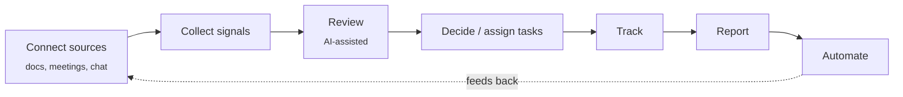
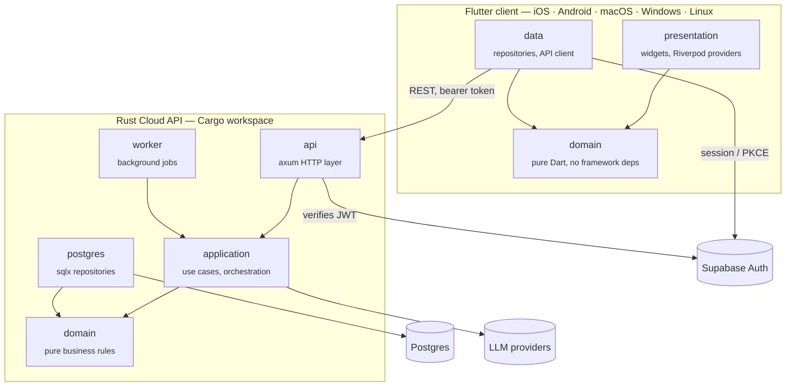
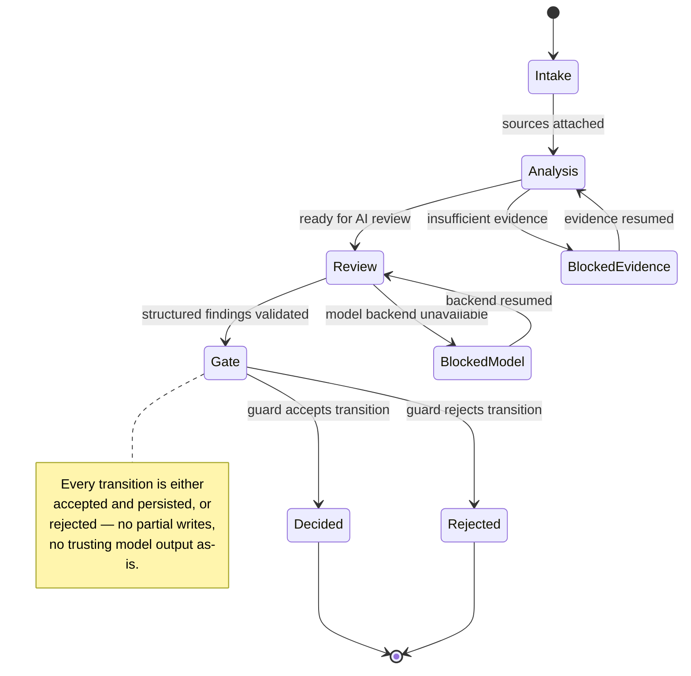
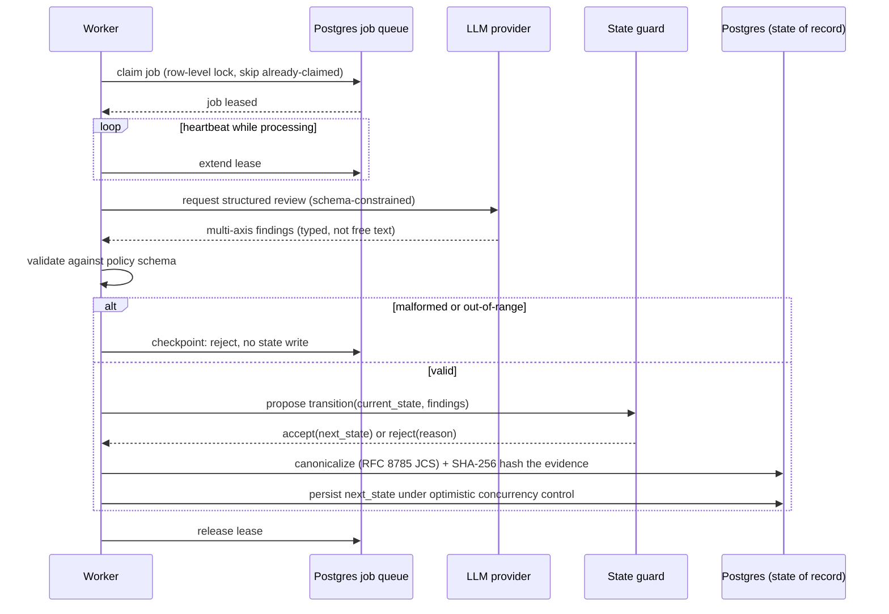

# Solomon

Solomon is an AI-native decision workspace for teams. It turns meetings, documents, and incoming
signals into tracked decisions, follow-up tasks, and reports, with AI personas assisting review
instead of people manually chasing every follow-up.

## Core loop

Everything under "Decide / assign" produces a **decision** or a **directive** (task) that stays
attached to the meeting/document it came from, so reports are always traceable back to source.

## System architecture

Client and server are both organized as layered/Clean Architecture, so the domain rules on each
side stay independent of frameworks (Flutter, Axum, Postgres).

**Authority stays server-side.** Meeting-state transitions, report generation rules, RAG
selection, cost limits, and permission checks live only in the Rust `domain`/`application`
crates — the Flutter client never re-implements them, it renders whatever the API returns. A
client-supplied `workspace_id`, `user_id`, role, or cost estimate is never treated as an
authorization source by the server.

## AI review engine (conceptual)

None of this code is public — this diagrams the *shape* of the system, not the implementation.
The model never writes state directly: it proposes a transition, and a total guard function
either accepts it and persists the next state, or rejects it outright.

Reviews themselves are structured, multi-axis findings validated against a fixed schema before
they're allowed near the guard — malformed or out-of-range output is a hard rejection, not a
best-effort parse. Job processing is safe under concurrency, and every accepted transition is
content-addressed so what the model saw and what it decided are both reconstructable later:

The interesting engineering problem isn't "call an LLM" — it's constraining what an LLM's output
is allowed to do to a system of record, and making every step of that auditable. The specific
review axes, approval-policy thresholds, and prompts are the actual product and stay closed.

## Features

| Area | What it does |
|---|---|
| Meetings | Run/record meetings, AI persona review, extract decisions & follow-ups |
| Decisions | Structured decisions with the framework/rationale behind each one |
| Directives | Tasks generated from meetings/decisions, owner + due date tracked |
| Documents | Source documents connected as review/report input |
| Reports | Generated from tracked decisions/directives, traceable to source |
| Agents | AI personas that assist review and can be published for reuse |
| Dashboard | Workspace-level signal & activity overview |

## Tech stack

| Layer | Stack |
|---|---|
| Client | Flutter, Dart, Riverpod (state/DI), Clean Architecture |
| Server | Rust, Axum (HTTP), sqlx (Postgres), Tokio |
| Auth | Supabase Auth (JWT), PKCE flow on the client |
| Data | Postgres |
| AI | LLM-backed meeting personas, RAG over connected documents |

## Repositories

| Repo | What it is |
|---|---|
| [`solomon`](https://github.com/Solomon-Platform/solomon) | Monorepo: Flutter client + Rust Cloud API (private) |
| [`solomon-workspace-ui`](https://github.com/Solomon-Platform/solomon-workspace-ui) | Offline UI shell extracted from the client — no backend, in-memory fixtures only |
| [`rfc8785-jcs`](https://github.com/Solomon-Platform/rfc8785-jcs) | RFC 8785 JSON Canonicalization (Rust) — the hashing primitive behind the content-addressed state transitions above |
| [`pg-lease-queue`](https://github.com/Solomon-Platform/pg-lease-queue) | Postgres job queue (Rust) — the claim/lease/heartbeat pattern behind the worker's safe-under-concurrency job processing above |
| [`openrouter_dart`](https://github.com/Solomon-Platform/openrouter_dart) | OpenRouter client (Dart) — tool-calling loop with parallel execution + reasoning-model recovery, plus a Tavily search client |
| [`jwks-verifier`](https://github.com/Solomon-Platform/jwks-verifier) | JWKS JWT verifier (Rust) — the auth boundary in front of the API above, framework-agnostic |
| [`idempotency-key`](https://github.com/Solomon-Platform/idempotency-key) | Idempotency-Key handling (Rust) — the header validation/request-hash pair behind the API's mutation endpoints |
